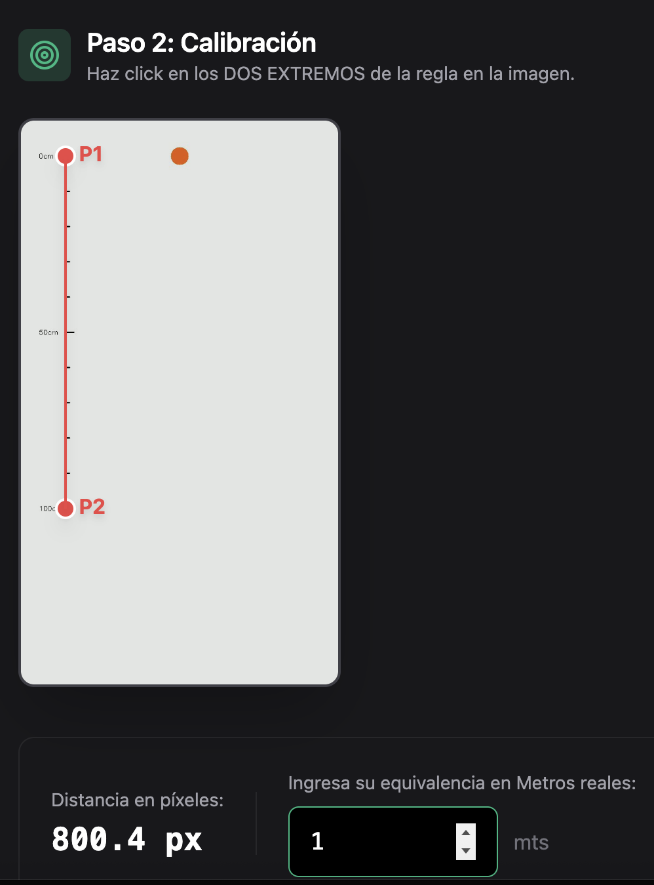
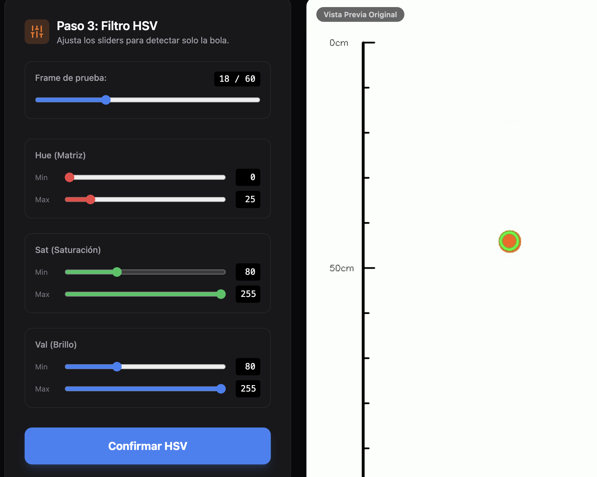
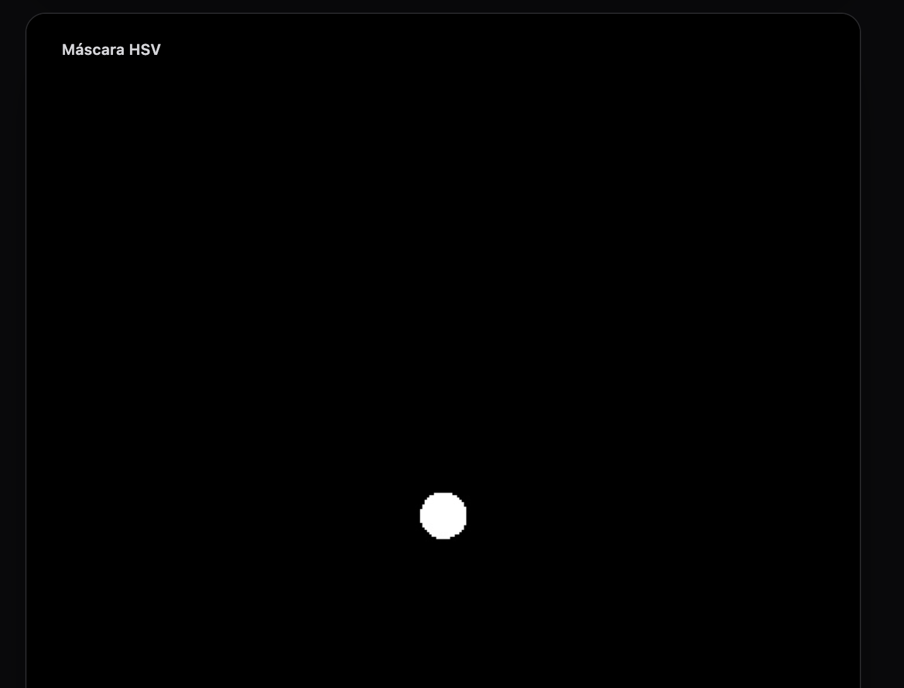
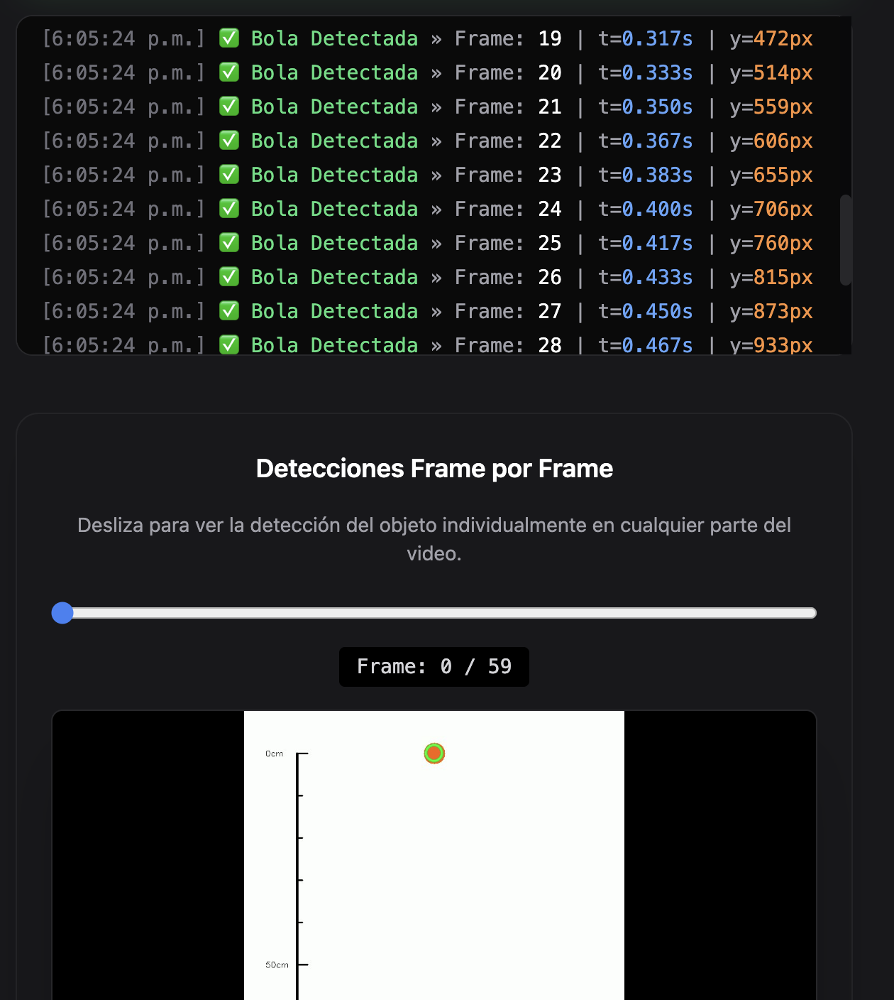
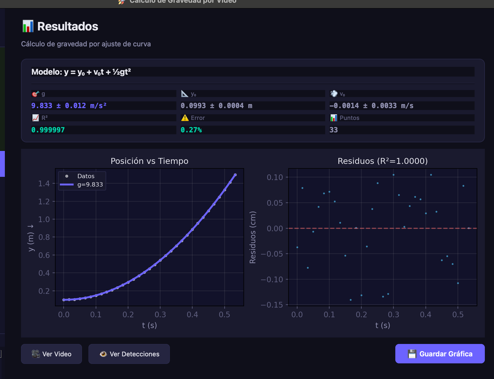

# Sensado y Modelado de Sistemas Físicos

Repositorio dedicado a documentar y centralizar todas las actividades, prácticas y códigos desarrollados en la asignatura de **Sensado y Modelado de Sistemas Físicos**. Incluye implementaciones, ejercicios, experimentos y recursos utilizados para el análisis, simulación y comprensión del comportamiento de sistemas físicos a partir de datos.

---

## 🚀 Proyectos y Actividades

### 1. Estimación Manual de Caída Libre (`01_manual_gravity_estimation/`)
Análisis tradicional en el cual calculamos la gravedad extraída de un objeto en caída libre de forma manual evaluando modelos físicos.

### 2. Suite Automatizada: Gravedad Tracker (`02_automated_gravity_tracker/`)
Una completa y rigurosa suite analítica diseñada para estimar automatizadamente la constante gravitacional ($g$) procesando cinemáticamente videos de objetos en caída libre. A diferencia del método manual, este motor extrae la telemetría utilizando algoritmos avanzados de Visión Computacional, paralelismo y ajustes numéricos para lograr precisión científica de altísima fidelidad ($R^2 \approx 0.99$).

#### 📌 Metodología y Flujo Computacional
El flujo de procesamiento del sistema abstrae completamente la intervención manual y los desvíos del error humano basándose en cuatro grandes bloques matriciales:

- **Calibración a Escala Real:** Conversión abstracta de los ejes de vista de píxeles a metros reales empleando el Teorema de Pitágoras e inserción de una regla de referencia ($px \rightarrow m$).
  <br>
  

- **Segmentación por Filtro Cromático (HSV):** Detección interactiva purificando dinámicamente el contorno esférico sobre el fondo empleando máscaras con restricciones estáticas \`cv2.inRange\`.
  <br>
   

- **Seguimiento Continuo y Centroide:** Cálculo matricial iterativo de momentos de imagen ($M_{ij}$) que persigue el instante exacto posición-tiempo ($y, t$) del vuelo cuadro por cuadro eludiendo sesgos.
  <br>
  

- **Ajuste Estadístico No Lineal:** Regresión parabólica mediante el optimizador Levenberg-Marquardt (\`scipy.optimize.curve_fit\`) calculando 3 grados de libertad paramétricos conjuntos ($y = y_0 + v_0t + \frac{1}{2}gt^2$).
  <br>
  


#### 🛠️ Arquitectura Asíncrona Desarrollada

Se abandonó la monolítica versión inicial para desarrollar una **Arquitectura Cliente-Servidor (Web SPA)** de alto rendimiento que evite latencias matriciales estrepitosas:

1. **🚀 Backend Matemático (FastAPI + OpenCV + SciPy)**
   Programado en Python puro usando FastAPI. Implementa un puente asíncrono riguroso inyectando eventos continuos \`Server-Sent Events\` (SSE - NDJSON). Delega al servidor la decodificación de video, las rutinas generadoras de derivadas subyacentes y el complejo rastreo, transmitiendo únicamente fracciones diminutas al visualizador.
2. **✨ Frontend Interactivo (React + Vite + Tailwind)**
   SPA moderna construida en TypeScript/React. Proporciona todo el lienzo interactivo donde el experimentador dictamina el factor de calibración, ajusta su espectro HSV para ver previsualizaciones Base64 y enciende el Streaming en tiempo real mientras evalúa la caída trazándose dinámicamente apoyado en librerías gráficas como \`Recharts\`.

#### 💻 ¿Cómo Desplegar el Aplicativo Localmente?

Para levantar todo el entorno algorítmico concurrente:

**1. Lanzar el Servidor Numérico (Backend):**
Navega a la carpeta del motor matemático local y arranca su estado en entorno virtual.
```bash
cd 02_automated_gravity_tracker/backend
pip install -r requirements.txt
python3 -m uvicorn main:app --reload
```
*(El servicio REST quedará a la escucha en `localhost:8000`)*

2. **Frontend:**
   Navega al directorio del panel de React y lanza la interfaz en entorno de Node.
   ```bash
   cd 02_automated_gravity_tracker/frontend
   npm install
   npm run dev
   ```
   *Accede desde tu navegador al puerto 5173 e interactúa con el Tracker.*
