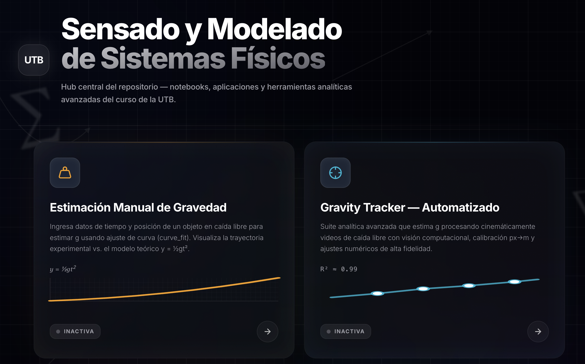
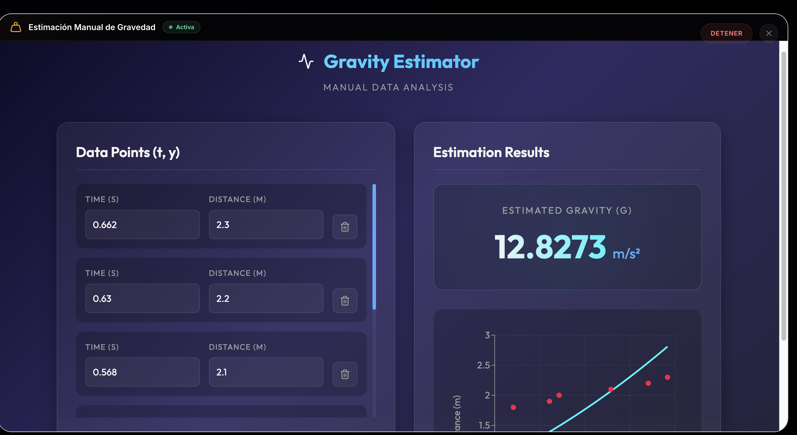
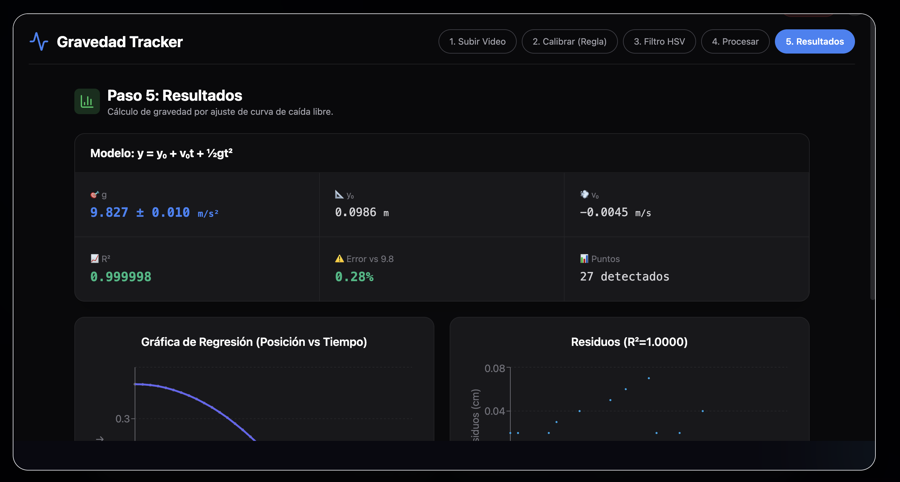
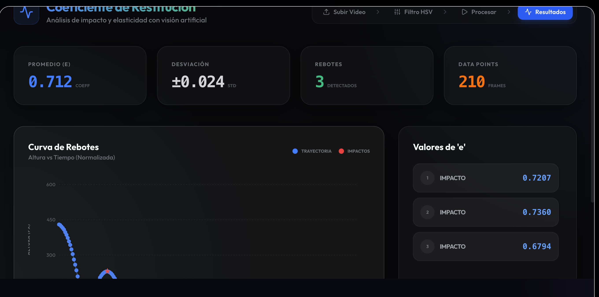
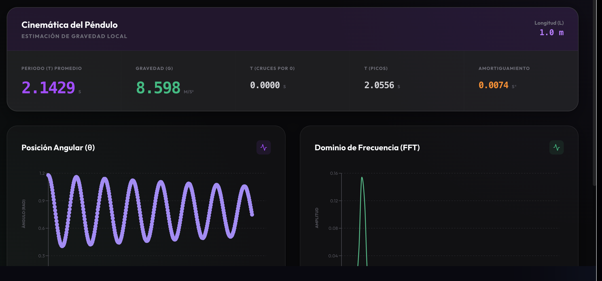

# Sensado y Modelado de Sistemas Físicos

Repositorio dedicado a documentar y centralizar todas las actividades, prácticas y códigos desarrollados en la asignatura de **Sensado y Modelado de Sistemas Físicos**. Este espacio integra herramientas avanzadas de visión computacional, análisis numérico y simulaciones interactivas para el estudio de sistemas físicos.

---

## 🍱 Bento Launcher: El Centro de Control

Para facilitar la navegación y ejecución de los diferentes módulos, se ha desarrollado un **Bento Launcher** con estética premium. Este dashboard central permite lanzar cada uno de los experimentos de forma automatizada, gestionando los backends y frontends necesarios de manera transparente.

<p align="center">
  
</p>

### ✨ Características del Launcher:
- **Interfaz Glassmorphism**: Diseño moderno inspirado en las mejores interfaces de la industria (Apple/Stripe).
- **Lanzamiento Automatizado**: Orquestación de servicios locales (FastAPI + React) con logs en tiempo real.
- **Gestión de Procesos**: Capacidad de iniciar y detener servicios directamente desde el dashboard.

---

## 🚀 Aplicaciones del Laboratorio

El repositorio se divide en 4 grandes bloques experimentales, cada uno con su propia arquitectura cliente-servidor:

### 1. Estimación Manual de Gravedad (`01_manual_gravity_estimation/`)
Análisis tradicional donde el usuario ingresa datos de tiempo y posición de un objeto en caída libre. Utiliza ajustes de curva (`curve_fit`) para estimar la gravedad evaluando modelos teóricos.

<p align="center">
  
</p>

### 2. Gravity Tracker Automatizado (`02_automated_gravity_tracker/`)
Suite analítica que emplea **Visión Computacional** (OpenCV) para extraer la telemetría de un video de caída libre. Realiza segmentación HSV, seguimiento de centroides y ajustes estadísticos no lineales para una precisión científica extrema.

<p align="center">
  
</p>

### 3. Coeficiente de Restitución (`03_coefficient_restitution/`)
Detecta automáticamente los instantes de impacto de una pelota en rebote mediante análisis de video. Calcula la pérdida de energía y el coeficiente de restitución analizando la secuencia de alturas máximas.

<p align="center">
  
</p>

### 4. Péndulo Simple (`04_simple_pendulum/`)
Estudia el movimiento armónico simple. Utiliza seguimiento de color para obtener la posición angular y aplica una **Transformada Rápida de Fourier (FFT)** para encontrar la frecuencia dominante, permitiendo calcular la gravedad a partir del período de oscilación.

<p align="center">
  
</p>

---

## 🛠️ Ejecución del Ecosistema

Para disfrutar de la experiencia completa, lo más recomendable es utilizar el lanzador central:

### 🚀 Lanzar el Bento Launcher:
1. **Instalar dependencias y arrancar:**
   ```bash
   cd bento-launcher
   npm install
   npm run dev
   ```
2. **Acceder a la interfaz:**
   Abre [http://localhost:5173](http://localhost:5173) en tu navegador.
3. **Lanzar Apps:**
   Haz clic en "Lanzar App" en cualquiera de las tarjetas para que el sistema orqueste automáticamente los backends de Python y los frontends de React correspondientes.

---

